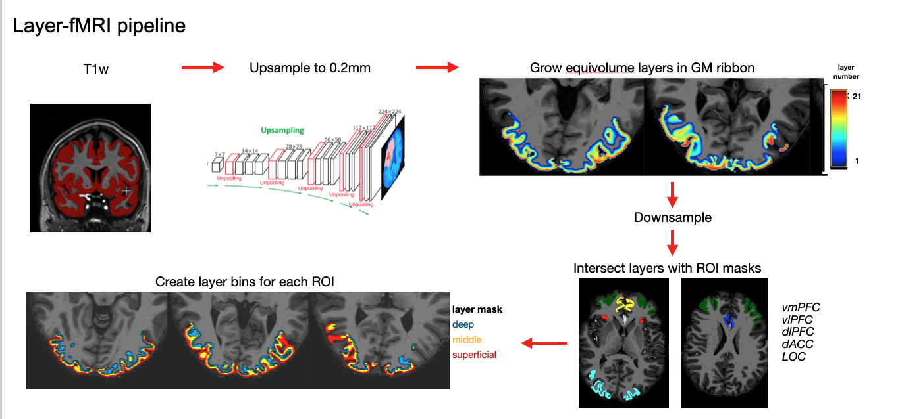

# Neuroimaging Analysis Examples (7T MRI)

Example workflows for **ultra‑high‑field (7T) neuroimaging analysis**, including preprocessing, laminar analysis, univariate modeling, multivariate analysis, representational similarity analysis (RSA), and connectivity analyses.

This repository illustrates modular strategies commonly used in high‑resolution cognitive and affective neuroscience studies.

The code is organized into stages corresponding to different parts of a typical neuroimaging pipeline.

---

# Overview

The repository demonstrates a full analysis workflow spanning:

1. Preprocessing of high‑resolution MRI data  
2. Anatomical segmentation and spatial registration  
3. Layer‑resolved ROI analyses  
4. First‑ and second‑level GLM modeling  
5. Multivariate analyses (searchlight, LSS)  
6. Representational similarity analysis (RSA)  
7. Functional connectivity analyses  
8. Group‑level statistical modeling  

---

# Conceptual framework

Many analyses in this repository focus on **changes in neural representations** across experimental conditions.

Such representational measures are typically quantified using multivariate approaches such as **searchlight decoding, representational similarity analysis, and cross‑validated distance metrics**.

---

# Layer‑fMRI processing pipeline

The repository also contains example workflows for **layer‑resolved analysis of high‑resolution fMRI data**.



Typical steps include:

1. Upsampling anatomical images to increase segmentation precision  
2. Growing **equivolume cortical layers** within the gray‑matter ribbon  
3. Downsampling layers to functional resolution  
4. Intersecting layer maps with region‑of‑interest masks  
5. Extracting layer‑specific signals within each ROI  

These procedures enable investigation of **laminar‑specific neural computations**.

---

# Repository Structure

```
neuroimaging-analysis-examples
│
├── preprocessing/
│
├── registration/
│   ├── template/
│   └── freesurfer/
│
├── layers/
│
├── first_level/
│
├── second_level/
│
├── multivariate/
│   ├── rsa/
│   ├── searchlight/
│   ├── lss/
│   └── connectivity/
│
└── group_stats/
```

Each module contains scripts implementing one stage of the analysis workflow.

---

# Preprocessing

`preprocessing/`

Scripts for preprocessing high‑resolution fMRI data.

Typical operations:

* motion estimation
* run‑to‑run alignment
* anatomical registration
* brain extraction
* reslicing and interpolation

Example outputs:

```
preprocessed_func.nii.gz
motion_parameters.tsv
aligned_run_func.nii.gz
```

The preprocessing workflow aims to **minimize interpolation and preserve spatial resolution**, which is particularly important for high‑field imaging.

---

# Registration

`registration/`

Tools for anatomical segmentation and spatial normalization.

## Template registration

`registration/template/`

High‑precision nonlinear registration using **ANTs**.

Example outputs:

```
T1_to_template_Warped.nii.gz
T1_to_template_0GenericAffine.mat
```

## FreeSurfer segmentation

`registration/freesurfer/`

Cortical reconstruction and volumetric segmentation using **FreeSurfer**.

Example outputs:

```
aparc+aseg.mgz
ribbon.mgz
lh.white
rh.pial
```

These outputs serve as the basis for **ROI and layer analyses**.

---

# Layer Analysis

`layers/`

Scripts for extracting signals from cortical layers.

Operations include:

* generating equivolume cortical layers
* intersecting layers with ROI masks
* computing layer‑specific activation
* performing layer‑specific RSA
* comparing signals across layers

Example outputs:

```
layer_signal_roi_vmPFC.csv
layer_signal_roi_dlPFC.csv
layer_rsa_results.csv
```

These analyses enable investigation of **laminar differences in neural processing**.

---

# First‑Level Analysis

`first_level/`

Subject‑level GLM analyses.

Steps include:

* creation of event/onset files
* design matrix construction
* GLM estimation
* condition contrasts

Example outputs:

```
sub01_contrast_conditionA.nii.gz
sub01_contrast_conditionB.nii.gz
design_matrix.png
```

---

# Second‑Level Analysis

`second_level/`

Group‑level modeling and inference.

Typical analyses:

* combining subject contrast maps
* fixed‑effects models
* permutation‑based inference

Example outputs:

```
group_stat_map.nii.gz
thresholded_cluster_map.nii.gz
```

---

# Multivariate Analyses

`multivariate/`

Contains scripts implementing pattern‑based analyses.

## RSA

`multivariate/rsa/`

Computes representational similarity or cross‑validated distance matrices.

Example outputs:

```
rsa_matrix.npy
crossnobis_distances.csv
```

## Searchlight

`multivariate/searchlight/`

Voxel‑wise representational analyses.

Example outputs:

```
searchlight_accuracy_map.nii.gz
searchlight_rsa_map.nii.gz
```

## LSS modeling

`multivariate/lss/`

Least‑Squares‑Separate models for estimating **trial‑level beta maps**.

Example outputs:

```
trial_beta_maps/
beta_trial001.nii.gz
beta_trial002.nii.gz
```

---

# Connectivity Analyses

`multivariate/connectivity/`

Scripts for computing functional connectivity between ROIs.

Example outputs:

```
roi_connectivity_matrix.csv
roi_connectivity_session1.csv
roi_connectivity_session2.csv
```

---

# Group‑Level Statistics

`group_stats/`

Group‑level statistical analyses and visualization.

Example outputs:

```
roi_layer_lme_results.csv
group_summary_plot.png
```

---

# Dependencies

Python packages commonly used:

* numpy
* scipy
* pandas
* nilearn
* scikit‑learn
* matplotlib / seaborn

External neuroimaging tools:

* ANTs
* FreeSurfer
* FSL
* LAYNII

---

# Notes

This repository contains **example analysis workflows** illustrating neuroimaging data processing strategies.

Dataset organization and parameters may require adaptation for specific studies.
